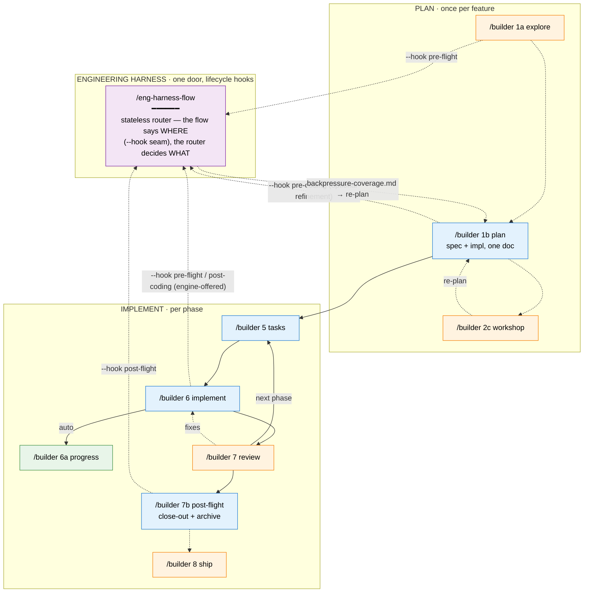
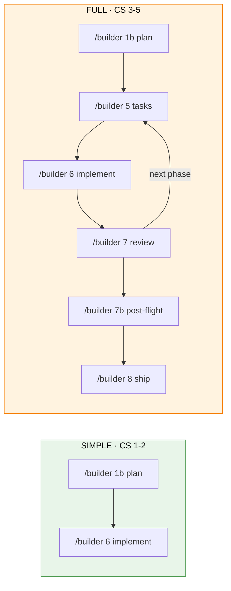

<!-- 🔄 RENDERED from SKILL.md § Registry + references/00-routing.md § Graph — regenerate against those masters, never hand-edit as the primary. -->
# The SDD Pipeline (`/the-flow`) + the Engineering Harness — Getting Started

A visual guide to the **spec-driven-development** pipeline — shipped as one progressive-disclosure skill, **`the-flow`** — and the **engineering harness** that runs side by side with it. The entry point is almost always bare `/the-flow` (guided mode), or a direct jump like `/builder 1a explore` (research) / `/builder 1b plan` (the planning document — business spec + implementation plan). Everything else chains from there.

> Repo reference: the SDD pipeline is packaged here as `skills/builder/` — one public skill built to the flow-architecture pattern, with per-stage **sub-skills** under `references/stages/`. The harness skills live in this same `AI-Substrate/harness-engineering` package and are reached through exactly one door: the **`/eng-harness-flow`** router.

---

## One public skill, progressive disclosure

The pipeline used to be a family of standalone per-stage skills; it is now **one skill** composed of lazily-loaded **sub-skills** (contract-bound verbs that know nothing about the flow — the dispatch's Registry assigns their ids, and the Graph in `references/00-routing.md` owns every edge). Same pipeline, same stages, same order, same optional branches — only the surface changed. The public grammar is:

```
/builder                       # guided mode — the co-pilot drives
/builder <id|verb> [flags]     # direct jump — run exactly one stage
```

- **Guided mode** — bare `/the-flow` loads `references/coach.md` + `references/00-routing.md` + the *current* stage's sub-skill only, then drives you conversationally. The rest of the pipeline stays out of context until you reach it.
- **Direct jump** — `/builder 6 implement --phase … --plan …` loads exactly **one** sub-skill and runs that stage. Ids and verbs each resolve alone when typed (`6` ≡ `implement`); printed commands always carry both.
- **Back-compat** — old per-stage slugs found in pre-consolidation state files (and typed `6c`/`companion`) are translated by the dispatch's translation/alias table; you never type them.

| Stage | Id | Verb | Sub-skill loaded |
|---|---|---|---|
| Explore (research) | `1a` | `explore` | `references/stages/10-explore.md` |
| Plan (spec + impl) | `1b` | `plan` | `references/stages/20-plan.md` — writes the business spec **and** the implementation plan into one document, always both; mid-plan clarify re-entry lives inside, as a Re-entry section |
| Workshop | `2c` | `workshop` | `references/stages/25-workshop.md` |
| ADR | `3a` | `adr` | `references/stages/35-adr.md` |
| Phase tasks | `5` | `tasks` | `references/stages/50-phase-tasks.md` |
| Implement | `6` | `implement` | `references/stages/60-implement.md` |
| Progress | `6a` | `progress` | `references/stages/62-progress.md` |
| Review | `7` | `review` | `references/stages/70-review.md` |
| Post-flight | `7b` | `post-flight` | `references/stages/75-post-flight.md` — pre-ship close-out: completion check, `assets/post-flight.md` note, archives the whole plan folder to `docs/plans/archive/<ord>-<slug>/`; the terminal harvest seam fires here. Typed `archive` / `close-out` resolve here |
| Ship | `8` | `ship` | `references/stages/80-ship.md` — push + open PR (repo-guidance-aware) + watch CI checks; push & PR-open each behind a confirm; reads the plan from its archive path |
| Reconcile | `8c` | `reconcile` | `references/stages/80-merge.md` — conditional upstream-reconcile excursion (divergent base); merge on typed `PROCEED`. Typed `merge` / `plan-8-v2-merge` resolve here |
| Reconcile spine *(maintenance)* | `sync` | `sync` | `references/00-routing.md` § Reconcile the spine — engine pass, **auto-fired every guided entry** (idempotent); keeps every past/present/future phase + workshop + harness seam-node present in the flight plan. Not a journey stage; also invokable on demand. Distinct from `8c reconcile` (git-base merge) |

> **What changed (formerly)**: each stage was its own public skill — `/plan-1a`; `/plan-1b` (specify) **and** `/plan-3` (architect), now folded into the single `1b plan` step that writes the business spec and implementation plan into one document in one atomic pass; `/plan-2` (clarify — now the Re-entry section of stage 1b); `/plan-2c`, `/plan-3a`, `/plan-5`, `/plan-6` (+ its retired companion variant), `/plan-6a`, `/plan-7`, `/plan-8`. Those skills are deleted; `/builder <id|verb> [flags]` is the only public surface for the main flow (typed `6c` or `companion` still resolves, via the alias table, to plain implement — companion mode is retired; typed `specify` or `architect` resolve to `1b plan`). The utility skills (`validate-v2`, `deepresearch-v2`, `didyouknow-v2`, `htmlify-v2`, `plan-0-v2-constitution`, `plan-2b-v2-prep-issue`, `plan-v2-extract-domain`, `util-0-v2-handover`, `install-hve-core-rpiv`) are unchanged and still called by their own names.

---

## The Big Picture

Two loops run side by side in the same context — that is all. Neither owns the other:

- **SDD pipeline** (you drive it) — `/builder 1a explore → 1b → [2c] → 5 → 6 → 7 → 7b → 8`, one stage per call (by id or by name). A linear journey: plan (spec + impl, one document) → tasks → code → review → **post-flight** (close-out + archive — runs even if nothing ever ships) → **ship** (push + PR + watch checks, optional and later), with the optional post-spec backpressure check as a post-plan refinement off 1b, and the upstream **reconcile** (8c) as a conditional excursion when the base has diverged.
- **Engineering harness** (the external eng-harness family drives it) — a *cycle*: Boot → Backpressure → Observe → Retro → Improve. The flow's stages never run harness stages themselves; the guided **engine** offers each seam at the Graph edge (seams are **flow-owned** — `references/harness-seams.md`; the stage sub-skills are harness-blind) and tells the router *where the work is* via a lifecycle **hook**:

| Seam (Graph edge) | Offered by | Router call (`--event` alias) |
|---|---|---|
| flow entry | the engine, at flow entry | `/eng-harness-flow --hook pre-flight` (`session-start`) |
| post-plan refinement off 1b | the engine, as a Graph-edge beat | `/eng-harness-flow --hook pre-coding --spec <path>` (`post-spec`) |
| before each phase | the engine, before the phase | `/eng-harness-flow --hook pre-flight --phase <id> --plan-dir <p>` (`pre-implement`) |
| each phase end | the engine, at the phase-end edge | `/eng-harness-flow --hook post-coding --plan-dir <p>` (`phase-end`) |
| at post-flight | the engine, at the close-out stage — before the archive move, before any ship | `/eng-harness-flow --hook post-flight --plan-dir <p>` (`plan-complete`) |

The flow wires **four fire-hooks** (`pre-flight` at the two edges, `pre-coding`, `post-coding`, `post-flight`); `coding` gets **no `/eng-harness-flow` fire-hook** (silent in *that* sense), but `observe` **is** still a **per-phase chore** the-flow bakes (the `harness observe "<what>" --kind <kind>` capture, `branch_of` the phase) — separate from these four. The router's child skills are **private** — they may move or rename, and no SDD stage (or user doc) ever names them. One name is stable: `/eng-harness-flow` + its `--hook` vocabulary (permanent `--event` alias). Full seam map: `docs/how/the-flow-harness-seams.md`.

> **New to this, or want a guide?** Run bare **`/the-flow`** — guided mode walks you through this whole pipeline: it asks what you want to build, narrates each stage, points out one insight per artifact, surfaces the optional branches + `/compact` seams + the harness seams, prints every command first, and offers to run it for you. Re-entrant — it survives `/compact` and can adopt a plan you started by hand. Already know where you're going? Jump straight in: `/builder 6 implement --phase … --plan …`.



**Legend**: 🔵 blue = you call it · 🟢 green = auto-called · 🟠 orange = optional · 🟣 purple = the harness router. Solid = main flow, dashed = optional/automatic.

---

## Detection — what happens when there's no harness

Two layers, one calm warning, never a gate:

**Layer 1 — is the router installed?** At flow entry, SDD probes `test -f ~/.agents/skills/eng-harness-flow/SKILL.md` (fallback `~/.claude/skills/eng-harness-flow/SKILL.md`). On a miss, you see exactly one message:

> ⚠️ No engineering harness detected — the eng-harness skills aren't installed. Continuing without one: standard testing applies, nothing else changes. (To add the harness loop: `harness skills install --target claude-code --global`.)

…then no harness router call ever fires for the rest of the flow — the baked flight-plan nodes simply stay un-run (never stripped). No sentinel files, no re-warnings — opting out is conversational ("don't use the harness" and the agent stops calling it).

**Layer 2 — is the repo provisioned?** Router installed → each seam call returns a `--json` envelope (`decision: route | redirect | noop | ambiguous`). A repo with no harness substrate gets one calm line (*"No engineering harness in this repo — proceeding without one; say 'set up a harness' anytime."*), and later seam calls pass `--prompt-optional=false` so you're never nagged. An installed-but-unprovisioned repo shows that calm line; the per-phase harness nodes are **baked into the flight plan from `create` regardless** — provisioning gates only whether they're **run**, never whether they exist (they sit un-run until then). Boot verdicts are narrated **verbatim from the envelope**: `healthy / SLOW / UNHEALTHY / UNAVAILABLE` — only `UNHEALTHY` ever pauses to ask you; `UNAVAILABLE` just means standard testing.

---

## Two paths: Simple vs Full

The mode is chosen in stage 1b (the Workflow Mode question, or `--simple` to pre-set it).



**Simple Mode** — single-phase, inline tasks. `/builder 1b plan` (front-loads clarifications, writes spec + plan in one document) → `/builder 6 implement`. No `/builder 5 tasks` expansion needed.

**Full Mode** — multi-phase. `/builder 1b plan`, then a per-phase loop of `/builder 5 tasks → /builder 6 implement → /builder 7 review`, then `/builder 7b post-flight` to close out + archive, then (optionally, whenever) `/builder 8 ship` to push, open the PR, and watch checks.

> **Merged stages**: stage `1b plan` produces the **business spec and the implementation plan in one document**, in one atomic pass — front-loaded clarifications up front, the validate gates (G1–G7) run inline, and `/validate-v2` auto-runs at the end. Later mid-plan clarifications re-enter through the Re-entry section inside `references/stages/20-plan.md`. There is no separate specify, clarify, architect, or complete-the-plan stage in the flow.

---

## Example Walkthrough

> **Scenario**: Add a `POST /api/widgets` endpoint to an existing app. Full Mode. Router installed; repo provisioned with a harness.

```
1.  /builder 1a explore "how are API endpoints structured here?"
    → The engine offers /eng-harness-flow --hook pre-flight (the router checks
      the harness is alive; one calm line either way).
    → minimum-sufficient research (cheap scout; workers added only as the evidence demands;
      docs/plans/archive/ mined as institutional memory — never authoritative)
      → docs/plans/005-api-widgets/assets/research-dossier.md

2.  /builder 1b plan "POST endpoint to create widgets (name, color)"
    → Asks testing/mock/docs/mode questions up front, then writes ONE document:
      api-widgets-plan.md (CS-3, Full) — `## Business Specification` on top,
      `## Implementation Plan` below (inline gates G1–G7 + 2 research subagents;
      2 phases). /validate-v2 auto-runs.
    → Optional post-plan refinement (engine-offered): /eng-harness-flow --hook pre-coding --spec ...
      → assets/backpressure-coverage.md (advisory: what's provable vs eyeballed); re-run plan informed by it.

3.  /builder 5 tasks --phase "Phase 1: Route & Validation" --plan ".../api-widgets-plan.md"
    → tasks.md (harness seams are engine-owned — offered at the phase edge, not task rows).

4.  /builder 6 implement --phase "Phase 1: ..." --plan "..."
    → SEAM FIRST (engine-offered at the phase edge): /eng-harness-flow --hook pre-flight ... —
      the router proves the system runs before a line of code; verdict narrated
      verbatim (healthy → build).
    → Implements; the progress verb (6a) auto-tracks per task.
    → End of phase (engine-offered): /eng-harness-flow --hook post-coding ... — the router
      decides what reflection happens (the harness may offer a few environment improvements it noticed, one at a time).

5.  /builder 5 tasks + /builder 6 implement for Phase 2, then /builder 7 review ...

6.  /builder 7b post-flight --plan "..."
    → SEAM FIRST (engine-fired at this edge): /eng-harness-flow --hook post-flight ... —
      the long-horizon reflection: harvest + the encode offer, receipts landed.
    → Completion check, close-out note (assets/post-flight.md), then the whole plan
      folder archives: docs/plans/005-api-widgets/ → docs/plans/archive/005-api-widgets/.
      The flight is closed — shipping is optional from here.

7.  /builder 8 ship --plan "docs/plans/archive/005-api-widgets/..."
    → Push (confirm) + open PR (separate confirm, repo-guidance-aware) + watch CI
      checks; a red check routes back to a fix, then re-ship.
      A diverged base hands off to /builder 8c reconcile (merge typed-PROCEED-gated).
      Feature shipped 🎉
```

You never named a harness skill — the flow told the router *where the work was* at each seam, and the router did the rest. No router installed? Same walkthrough, minus the seam lines, plus one calm warning at step 1. And every step loaded exactly one stage module — the rest of the pipeline stayed out of context.

---

## Quick Reference

| Command | What it does | Produces | Harness behaviour |
|---|---|---|---|
| `/the-flow` | **Guided mode** — drives this whole pipeline conversationally (loads coach + routing + the current stage module only) | `the-flow.{json,md}` + `original-ask.md` | probes for the router; the engine offers the seams at the Graph edges, only via `/eng-harness-flow` |
| `/builder 1a explore` · `explore` | Deep-dive codebase research *(optional; mines `docs/plans/archive/` as non-authoritative institutional memory)* | `assets/research-dossier.md` | engine offers `--hook pre-flight` at flow entry |
| `/builder 1b plan` · `plan` | Business spec + implementation plan in one document (front-loaded clarifications; inline gates G1–G7; validate-v2 auto-runs) | `<slug>-plan.md` | engine offers `--hook pre-coding` backpressure as a post-plan refinement (seams engine-owned, not plan rows) |
| `/builder 2c workshop` · `workshop` | Design workshop for complex topics *(optional)* | `assets/workshops/<topic>.md` | — |
| `/eng-harness-flow --hook pre-coding` | Backpressure survey *(optional post-plan refinement)* | `assets/backpressure-coverage.md` | advisory output; informs your re-plan; never blocks |
| `/builder 3a adr` · `adr` | Architectural Decision Record *(optional)* | `docs/adr/*.md` | — |
| `/builder 5 tasks` · `tasks` | Task table + brief for one phase | `assets/tasks/<phase>/tasks.md` | — (harness seams engine-owned, offered at the phase edge) |
| `/builder 6 implement` · `implement` | Implement one phase | code + `execution.log.md` | engine offers `--hook pre-flight` (before) + `--hook post-coding` (after) |
| `/builder 6a progress` · `progress` | Progress tracking *(auto-run by the implement verb)* | updated task tables + execution log | none (progress only) |
| `/builder 7 review` · `review` | Code review | Full: `assets/tasks/<phase>/reviews/review.<phase>.md` · Simple: `assets/reviews/review.md` | none (read-only review) |
| `/builder 7b post-flight` · `post-flight` | Pre-ship close-out: completion check → `assets/post-flight.md` note → archive the whole plan folder to `docs/plans/archive/<ord>-<slug>/` (typed `archive`/`close-out` alias here) | archived plan folder + close-out note | engine fires `--hook post-flight` here — the terminal harvest, before the move |
| `/builder 8 ship` · `ship` | Get work out — push + open PR (repo-guidance-aware) + watch CI checks + report; push & PR-open each behind a confirm, merge optional; reads the plan from its archive path | pushed branch + PR + `assets/ship/<date>/ship-report.md` | — (the post-flight harvest already ran at 7b) |
| `/builder 8c reconcile` · `reconcile` | Conditional upstream-reconcile excursion (divergent base) — kept merge-analysis machinery; typed `merge` resolves here | reconcile/merge plan | merge executes only on typed `PROCEED` |
| `sync` *(maintenance — auto every entry; on-demand)* | **Reconcile the spine** — backfills every known phase + workshop + harness seam-node the flight plan is missing; idempotent, advisory, never advances the journey | updated `the-flow.{json,md}` | re-anchors per-phase harness seam-nodes across all phases (nodes only; `eng-harness-flow` owns the chore flag) |
| `/eng-harness-flow` | **The harness front door** — stateless router; detects where the loop is and routes one step | routing envelope (`--json`) | the only harness skill the flow ever calls |

---

## Directory Structure

```
docs/
└── plans/
    ├── 005-api-widgets/               ← live plans; moves to archive/ at post-flight
    │   ├── api-widgets-plan.md        ← /builder 1b plan (business spec + implementation plan)
    │   ├── original-ask.md            ← guided mode (verbatim ask)
    │   ├── the-flow.json + the-flow.md ← the flight plan (CLI-written)
    │   └── assets/                    ← everything else lives here (§ Plan-folder layout)
    │       ├── research-dossier.md    ← /builder 1a explore (optional)
    │       ├── backpressure-coverage.md ← post-spec seam (optional post-plan refinement)
    │       ├── workshops/             ← /builder 2c workshop (optional)
    │       ├── post-flight.md         ← /builder 7b post-flight (close-out note)
    │       ├── ship/                  ← /builder 8 ship (report per date)
    │       └── tasks/
    │           └── phase-1/
    │               ├── tasks.md
    │               └── execution.log.md
    └── archive/
        └── 003-older-plan/            ← completed flights (post-flight moved them; same layout)
```

*(Plans made before this layout keep their artifacts at the folder root — readers probe `assets/` first, then the legacy root; nothing is migrated.)*

The harness's own substrate (governance doc, observe scratch, retro records) lives under `.harness/` in repos that have one — owned and documented by the external family, not by SDD.

---

## Key Concepts

### Complexity Scoring (CS 1–5)

Assigned by stage 1b (`/builder 1b plan`). Drives Simple vs Full and how much planning ceremony applies.

| CS | Scope | Typical Phases | Path |
|----|-------|---------------|------|
| 1 | Trivial — config, typo | 1 | Simple |
| 2 | Small — single module | 1–2 | Simple |
| 3 | Medium — multiple modules | 2–3 | Full |
| 4 | Large — cross-cutting | 3–5 | Full |
| 5 | Epic — architectural | 5+ | Full |

### The harness relationship in one sentence

> SDD builds the feature; the harness proves the environment and compounds the friction — they run side by side in the same context, touching only at flow-owned seams (four lifecycle hooks, engine-offered at the Graph edges), all through one stable name: `/eng-harness-flow`.

The harness family's own getting-started guide ships with the router (`~/.claude/skills/eng-harness-flow/references/getting-started.md` once installed). The switchover that externalised it is recorded in `docs/plans/029-eng-harness-switchover/` and `CLAUDE.md` (vocabulary-freeze note, override #2).
