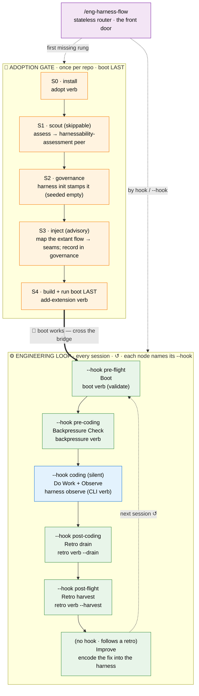
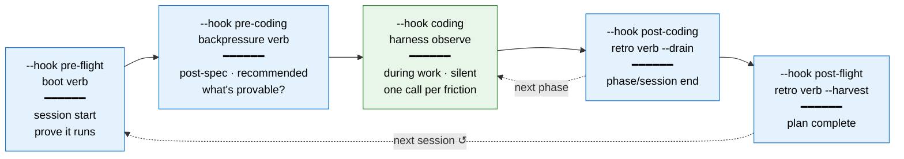
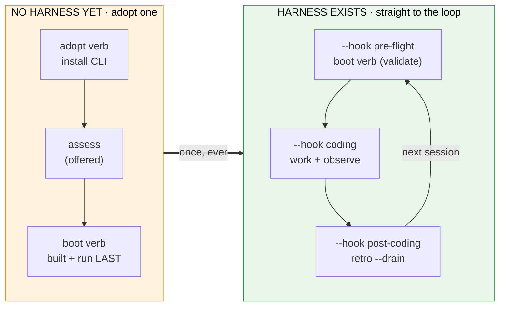

# The Harness Loop — Getting Started

A visual guide to the **engineering harness** and the loop it operates. The harness ships as **two public skills**: `eng-harness-flow` — the stateless front-door router (this skill) — and `eng-harness-0-harnessability-assessment` — a standalone "size up my repo" peer. The entry point is almost always **`/eng-harness-flow`**: it works out where your repo sits and hands back the one right next command — for most routes by loading exactly one **verb module** (`references/stages/<verb>.md`), and for the two exceptions by handing off to the assessment peer skill (`assess`) or the `harness observe` CLI verb (`coding`). Everything else chains from there.

> Repo reference: the router + its verb modules live at `skills/eng-harness-flow/` and the kept-public assessment peer at `skills/eng-harness-0-harnessability-assessment/` in [`AI-Substrate/harness-engineering`](https://github.com/AI-Substrate/harness-engineering). Full skill matrix: `skills/README.md`. Zero-context consumer-agent onboarding: `AGENTS_README.md`. CLI details: `harness/cli/README.md` (or in-CLI via `harness docs`).

---

## The Big Picture

The engineering harness exists because every agent session starts **cold**. Agents don't inherit tribal setup knowledge, repeated review feedback, or the last run's hard-won discoveries unless those things are **encoded into the repo**. The harness gives that encoding a home: a discoverable, runnable, deterministic surface for booting, checking, observing, validating, and improving the product. When you have to infer something important twice, prefer moving it out of tokens and into that surface — a command, check, fixture, smoke test, diagnostic, template, default, or clearer error.

Two zones, one bridge:

- **🧰 Adoption gate** (once per repo) — the repo *adopts* the harness: install the CLI, scout the repo, governance, an injection point into the flow you already run, and a **working boot command — built LAST**, deliberately, so the moment it works you run it and flow straight into real work.
- **⚙️ Engineering loop** (every session, forever) — the cycle that *runs* the substrate: `Boot → Backpressure Check → Do Work and Observe → Retro and Improve → Encode`, then back to Boot. It never "completes" — it compounds.

The router (`/eng-harness-flow`) sits *beside* both zones, not inside either: on every call it re-reads the repo's deterministic signals and routes you to the first missing adoption rung, or — once the gate holds — to the right loop stage for where your work is.

A parent flow that already knows where it is doesn't have to let the router guess — it **names the moment** with one of **five neutral lifecycle hooks** (`--hook pre-flight | pre-coding | coding | post-coding | post-flight`). That five-hook vocabulary is the stable, host-facing surface the rest of this guide keeps returning to (full contract: [§ The hook contract](#the-hook-contract-for-parent-flows)).



**Legend**: 🟠 orange = adoption gate · 🟢 green = loop verbs · 🔵 blue = a CLI verb, not a verb module · 🟣 purple = the router. Solid = the establishing order, dashed = routing / the cycle re-entering. Each **loop** node also names the `--hook` a host uses to reach it — that's the host-facing vocabulary (the **adoption rungs are not hooks**; `coding` is *silent* and `Improve` has none — see [§ The hook contract](#the-hook-contract-for-parent-flows)).

---

## How the two zones fit

The adoption gate produces the **substrate** (CLI → report → governance → injection point → a proven boot). The engineering loop produces **compounding value** — it proves the system runs before you touch it, catches friction while you work, and turns that friction into encoded improvements, so the next session is smoother than this one.

Three rungs are **required** before the router will route into the loop — without them the loop verbs honestly report `UNAVAILABLE` / no-op:

| Rung | What must hold | Required? |
|---|---|---|
| **S0 · Install** | harness CLI present, `harness doctor` healthy | **required** |
| **S1 · Scout** | a harnessability report exists | skippable |
| **S2 · Governance** | `.harness/engineering-harness.md` (the BIO contract) | **required** — *stamped by `harness init` (seeded empty); body fills at the Improve beat* |
| **S3 · Inject** | the governance doc's `## Injection map` — which seams your extant dev/SDD flow fires, from where (so the harness gets *used*, not just installed) | advisory |
| **S4 · Boot** | a working boot verb, authored **and run once** | **required** |

```
Boot ──────────────────────────────────────────────────────────────► Retro
  │                         Do Work                                     │
  │  ┌────────────────────────────────────────────────────────────┐    │
  └─►│   your normal dev flow (specs, plans, tasks, commits…)      │◄───┘
     │   (harness observe fires one-liner captures throughout)  │
     └────────────────────────────────────────────────────────────┘
```

---

## Where the loop plugs in — and who pulls the trigger

Each loop stage below carries the **lifecycle hook** a host flow names to reach it (`--hook <name>`, shown inline); the router maps the hook to the verb module/CLI verb. Two rows carry no hook — the **front door** and **Improve** — because neither is a seam a host fires: the router *is* the front door, and Improve simply follows whatever a retro decides. Full map + `--event` aliases: [§ The hook contract](#the-hook-contract-for-parent-flows).

| Loop stage · hook | Verb / target | Who calls it | When |
|---|---|---|---|
| **Front door** | `/eng-harness-flow` | **You**, or a parent flow, anytime | Whenever you're unsure where you are. Stateless — safe to call repeatedly; it re-derives position from repo signals every call and routes exactly one next step. |
| **Boot** · `--hook pre-flight` | `boot` verb (`--validate`) | **You** (or the router) at session start | Re-runs the boot that adoption built — proves the system is healthy *before* any code is written. Reports `UNAVAILABLE` (not an error) when no governance doc exists → routes back to adoption. |
| **Backpressure Check** · `--hook pre-coding` | `backpressure` verb | **You**, recommended, post-spec | After scoped work is defined, before you architect/build it. Surveys whether the work is *provable by deterministic sensors* (build/type/test/lint/smoke/boot/architecture/schema) vs inference; writes `backpressure-coverage.md`; can offer ready-to-paste "done when `<sensor>` is green" lines to encode into your acceptance criteria (or flag where backpressure looks too thin); may recommend an optional "Phase 0: Establish Backpressure". Advisory — the sensors prove, never the LLM. Never blocks. |
| **Observe** · `--hook coding` | `harness observe "<what>" --kind <kind>` | **You/your agent, the moment friction happens** | A CLI verb, not a verb module — one silent call per noticing (confusing failure, retry, backtrack, slow command, "if only there were…"). Lands in the gitignored buffer `.harness/temp/`. Capture judgment lives in the `retro` verb § in-flight capture. |
| **Retro (drain)** · `--hook post-coding` | `retro` verb `--drain` | **You** at phase/session end, buffer non-empty | The one normal user-facing retro prompt: a plain-language ask to save the session's notes (keep all · pick · skip — or take them further into tasks · a plan · diffs), then materialize kept entries into a committed record via `harness record retro` and clear the buffer. |
| **Retro (harvest)** · `--hook post-flight` | `retro` verb `--harvest` | **You**, at plan completion / periodically | Read-only curation across `.harness/records/retro/**` — what recurs, what's stale, what to encode next. Recurrence is framed as token cost. Drain first if the buffer is non-empty. |
| **Improve** | retro `[e]ncode` / `add-extension` verb | **You**, when a retro names a fix | The beat where the loop compounds: ship the fix as a command, sensor, fixture, or doc — then a `harness-change` record is written. A single coding session may legitimately encode nothing — but **at plan completion the agent must surface the top friction candidate out loud and make the encode offer explicit**. The user may decline; ending a plan silently with un-harvested friction is the exact failure this beat exists to prevent. |

**Opt-out is conversational.** There is no `.disabled` sentinel for the loop — if you don't want it, say so and the agent stops routing into it. Nothing gates, scores, or blocks.



---

## Two on-ramps: fresh repo vs existing harness

The router tells these apart from signals alone (a `.harness/` directory, project-local skills, a governance doc) — you never have to know which path you're on.



**Fresh repo** — the router stays on the 🧰 adoption track and routes the first missing required rung. **Existing harness** — S0 + S2 + S4 hold, so every call dispatches into the ⚙️ loop by **lifecycle hook**: `pre-flight` → boot, `pre-coding` → backpressure, `coding` → observe, `post-coding` → drain, `post-flight` → harvest. (Hosts that still emit the older `--event` seams — `session-start`/`pre-implement`, `post-spec`, `task-pause`, `phase-end`, `plan-complete` — alias straight onto those same five hooks.)

---

## Example Walkthrough

> **Scenario**: you point an agent at a repo that has never seen a harness. (This is the journey the `validate-harness-flow` extension replays end-to-end as a self-test — it's proven, not aspirational.)

```
0.  /eng-harness-flow
    → Router reads signals: no CLI, no .harness/ → routes the adopt verb (S0).
      "🧰 Looks like this repo hasn't adopted a harness yet — rung 0 of 5:
       install first; boot comes last."

1.  adopt verb        (S0 · install)
    → npm install -g @ai-substrate/engineering-harness   ← global, public npm, no auth
    → harness instructions   ← the agent briefing (AGENTS START HERE)
    → harness doctor --json  ← envelope healthy, exit 0

2.  assess  (S1 · scout, offered — delegates to the harnessability-assessment peer)
    → Writes .harness/reports/harnessability/latest.{md,json}
      — Operate-Today + Adaptability grades, proof ceilings, back-pressure surfaces.
      An honest "this repo isn't workable" here is a valid outcome.

3.  Governance (S2) — harness init
    → stamps .harness/engineering-harness.md (BIO skeleton, maturity L0, every
      other field a TODO). Idempotent never-clobber. The doc now exists but is empty;
      boot stays UNAVAILABLE until S4 builds the boot command. Nothing errors.

4.  add-extension verb               (S4 · checks + boot, built LAST)
    → harness new checks --wrap "npm test"     ← the mandated quality gate (lint/test/typecheck)
    → harness new boot   --wrap "npm test"     ← then a boot that composes `harness checks`
    → Verify independently — never trust your own scaffold:
      harness doctor --json · harness instructions boot · harness checks --json · harness boot --json
    → 🎉 boot's working — that's the harness alive. Cross the bridge.

5.  Work normally, loop around you:
    → boot verb (--validate) at each session start (re-RUN, never re-build)
    → backpressure verb once scoped work is specced, before building
    → harness observe "doctor's E143 message pointed at the
      wrong dir" --kind difficulty --severity degrading     ← the moment it happens

6.  retro verb --drain               (session end)
    → plain save prompt (keep all · pick · skip) → harness record retro → committed record in
      .harness/records/retro/ → buffer cleared.

7.  retro verb --harvest             (later, across sessions)
    → "this friction recurred 3× — encode it" → add-extension verb
    → the Improve beat ships a fix; a harness-change record is written. ↺
```

You can drive every step by hand, but you never have to *route* by hand — `/eng-harness-flow` at any point answers "where am I and what's next?" from the repo itself.

---

## Quick Reference

| Command | What it does | Produces |
|---|---|---|
| `/eng-harness-flow` | **Front door** — stateless router; host flows pin a lifecycle hook (`--hook pre-flight\|pre-coding\|coding\|post-coding\|post-flight`, with `--event` as an accepted alias); re-derives position from signals A–J and routes one next step — usually loading one verb module (or, for two routes, handing off to the assessment peer / the `harness observe` CLI verb) | nothing of its own (a routing decision; `--json` envelope for machine callers) |
| `adopt` verb | The adoption flow: install CLI → scout → inject → stand up `boot` (delegates: assess, add-extension) | installed CLI; orchestrates the rungs |
| `/eng-harness-0-harnessability-assessment` | The public peer — size up the repo: evidence vs inference vs unknowns | `.harness/reports/harnessability/latest.{md,json}` |
| `add-extension` verb | Guided authoring of a new `harness <verb>` (incl. `boot` at S4) | `.harness/extensions/<name>/` (entry + `instructions.md`) |
| `boot` verb | Re-run the boot adoption built; readiness verdict + maturity read | terminal report (healthy / SLOW / UNHEALTHY / UNAVAILABLE) |
| `backpressure` verb | Deterministic-sensor coverage survey for scoped work | `docs/plans/<ordinal>-<slug>/assets/backpressure-coverage.md` |
| `harness observe "<what>" --kind <kind>` | Capture one friction entry (CLI verb, not a verb module) | one buffer entry in gitignored `.harness/temp/` |
| `retro` verb `--drain` | Plain-language save prompt for the session's notes (keep all · pick · skip) | committed record via `harness record retro` |
| `retro` verb `--harvest` | Curated cross-plan friction view (read-only) | terminal print (`--json` for tooling) |
| `harness doctor --json` | What's configured + which extensions loaded/failed | JSON envelope, every complaint has a `next_action` |
| `harness instructions [verb]` | The agent briefing — AGENTS START HERE | terminal print |

> **Never run bare `npx harness`** — that fetches an unrelated npm package. The CLI is an **ambient global tool**, so after install just call `harness …` directly (it's on PATH). A no-global-write alternative is `npx @ai-substrate/engineering-harness …` (the scoped package, run from the npm cache).

The loop and adoption **verbs** (`boot` / `backpressure` / `retro` / `adopt` / `add-extension`) are not separate skills — they are harness-blind modules under `references/stages/`, loaded one at a time by the router. Only `/eng-harness-flow` and `/eng-harness-0-harnessability-assessment` are public skills.

---

## Directory Structure

```
<your-repo>/
├── .harness/
│   ├── engineering-harness.md      ← governance doc (BIO contract) — canonical, only location
│   │                                  (stamped by `harness init`, seeded empty; see references/governance-doc.md)
│   ├── extensions/
│   │   ├── checks/
│   │   │   ├── extension.ts        ← the mandated quality gate (lint/test/typecheck)
│   │   │   └── instructions.md     ← agent briefing (`harness instructions checks`)
│   │   └── boot/
│   │       ├── extension.ts        ← the verb (default-exports a HarnessVerb); composes `harness checks`
│   │       └── instructions.md     ← agent briefing (`harness instructions boot`)
│   ├── reports/
│   │   └── harnessability/
│   │       └── latest.{md,json}    ← the scout's graded report
│   ├── records/
│   │   ├── retro/                  ← COMMITTED team memory (drain materializes here)
│   │   └── harness-change/         ← the harness changelog: one record per ENCODED improvement
│   └── temp/                       ← GITIGNORED session scratch (the observe buffer)
└── AGENTS.md                       ← routes future agents to the harness at session start
```

The `harness` CLI itself is **not** in this tree — it's an **ambient tool** (installed globally, like `git`/`node`), never committed. Adoption leaves only `.harness/` substrate and the `AGENTS.md` cue in the repo.

Two storage classes, one rule: `.harness/records/` is **committed team memory**; `.harness/temp/` is **gitignored session scratch** (the CLI self-heals that protection; `doctor` checks it).

---

## Key Concepts

### Stateless routing — and CLI-driven flow position

`/eng-harness-flow`'s **routing is stateless**: it re-derives *which* flow is live, *which* rung is missing, and *where* the work sits on every call from deterministic substrate (`harness doctor`, the governance doc, the harnessability report, plan artifacts, the observe buffer) — so it survives `/compact`, serves any caller (a human, a parent flow like the SDD pipeline's `/the-flow`, a CI agent), and never drifts from reality. Routing, detection, and verdicts are never remembered.

What it **does** persist — the dogfood (plan 032) — is the **position of the flow it drives**, as a real CLI-owned flight plan (the `harness-adopt` / `harness-loop` overlays), written **only** through `harness flow` (never hand-edited). Alongside an active `the-flow` the loop rides as **chores in `the-flow.json`**; standalone it authors `.harness/loop.flow.json`. This supersession is **scoped to flow position only** — child artifacts remain the durable "done" signal for verb outputs, and flow position lives in the flight plan *by the CLI* (observable substrate, not router memory). See [`flight-plan-ops.md`](./flight-plan-ops.md).

### The hook contract (for parent flows)

A host running its own flow doesn't make the router guess where it is — it **names the moment** with a `--hook <name>`. There are exactly **five neutral lifecycle hooks**: the set is **fixed at five** (never grown per-repo) and **stateless** (re-derived every call, never stored). Each hook names a moment in *your* lifecycle — never a child-verb slug — so the harness vocabulary stays stable even as the verbs behind it are renamed or moved.

#### The five hooks

| Hook | The moment it names | Kind | Resolves to | Produces |
|---|---|---|---|---|
| `pre-flight` | boot / session start, before any code | **fire** | `boot` verb (`--validate`) | a boot verdict (healthy / SLOW / UNHEALTHY / UNAVAILABLE) |
| `pre-coding` | spec written, before you build | **fire** | `backpressure` verb | `backpressure-coverage.md` |
| `coding` | mid-build, the moment friction bites | **silent** | `harness observe "<what>" --kind <kind>` | one entry in the gitignored buffer (`.harness/temp/`) |
| `post-coding` | phase / session end | **fire** | `retro` verb `--drain` | buffer drained → committed retro record |
| `post-flight` | plan / journey end | **fire** | `retro` verb `--harvest` | terminal close-out: curated cross-plan view → **surface the top candidate out loud and offer the encode (never skip the offer; the user may decline)** |

Optional pins narrow a hook to the right target: `pre-flight` takes `[--phase <id>] [--plan-dir <p>]`; `pre-coding` takes `--spec <path>`; `post-coding` takes `--plan-dir <path>`.

#### Two kinds: **fire** vs **silent**

- A **fire** hook *routes a verb* — the host calls `/eng-harness-flow --hook <name>` and runs what the router hands back. Four of the five are fire hooks.
- The lone **silent** hook, `coding`, has **no `/eng-harness-flow --hook coding` to run**. The router only *describes* it; the actual capture is the `harness observe` CLI verb the host **hand-wires** into its flow — one quiet call per noticing (a confusing failure, a retry, a backtrack, "if only there were…"). This is why the `--hooks` discovery manifest carries `coding`'s `invoke` as the literal `harness observe "<what>" --kind <kind>` string, not a router command — a host must wire it from that string, not infer a fire.

#### `--event` is a permanent alias

`the-flow` and other hosts emit `--event <seam>`, and nothing that does will ever break — `--event` is a **permanent, transparent alias** for `--hook`. Six host seams fold onto the five hooks (`session-start` and `pre-implement` both open onto `pre-flight`):

| `--event` seam | → `--hook` |
|---|---|
| `session-start`, `pre-implement` | `pre-flight` |
| `post-spec` | `pre-coding` |
| `task-pause` | `coding` |
| `phase-end` | `post-coding` |
| `plan-complete` | `post-flight` |

#### Call discipline

- **One hook per call.** The router routes exactly one next step; the host calls again for the next moment.
- **A hook is a hint, not a command.** It's validated against the repo's signals and **redirected** when it can't hold — `--hook pre-flight` (alias `at=boot`) on a repo with no governance politely routes to adoption and says why; it never blindly runs the named stage.
- **Machine callers** add `--json` for the routing envelope (it carries the resolved `hook` field), and `--hooks --json` returns the full discovery manifest a host reads once to learn the contract.

Full vocabulary + the nine-field discovery manifest: the routing engine's [`00-routing.md` § Lifecycle hooks](./00-routing.md).

### Maturity (L0–L4)

The ladder runs from L0 (no harness — tribal knowledge) to L4 (self-improving — the harness regularly produces improvements during normal work). Boot *reads* the current level from the governance doc; the trajectory lives in the `harness-change` record ledger. Report the level that's actually working, never the aspirational one. Full ladder + assessment guide: [`maturity-assessment.md`](./maturity-assessment.md).

### The harness loop in one sentence

> Boot proves the system runs, Backpressure asks what's provable before you build, Observe catches friction while you work, Retro turns that friction into encoded improvements — so the harness *is* the product, and every difficulty catalogued is a gift to your future self.
