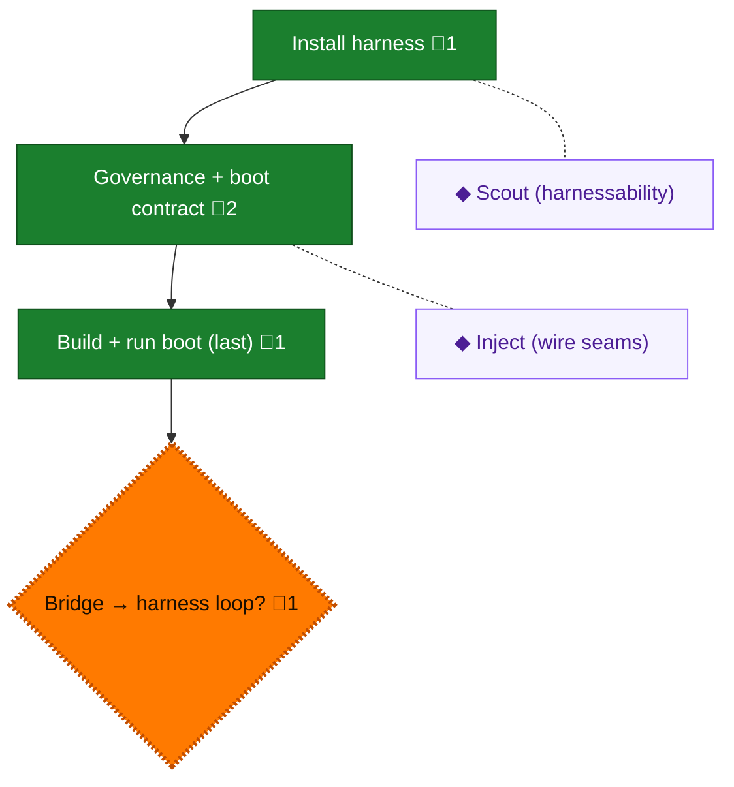

<!-- GENERATED by `harness flow render` — do not hand-edit; regenerate from the flow JSON. -->
# Flow · adopt

**Kind**: harness-adopt · **Now**: bridge · **Intent**: Adoption commands proven; enter the recurring harness loop · **Nodes**: 6 · **Events**: 20

**Rail**: ◆─[ ◆ ]─◆─◆  ◆ Install harness · [ ◆ Governance + boot contract ] · ◆ Build + run boot (last) · ◆ Bridge → harness loop?

**Legend** — colour = type/status: 🟩 done · 🟢 in-progress · 🟥 blocked · 🟦 known · ⬜ assumed · 🔶 decision · 🗣 user input · 🟪 harness chore (faded = not yet done) · 🤖 companion · 🛠 worker · 🟧 current (you are here). Badges: 💬 comments · 📄 artifacts · 📝 instructions · 🧰 chore (° optional / recommended / ‼ strongly-recommended; ✓ done · ✕ skipped).

## Node log

### install · Install harness
- `2026-08-13T05:18:50.025Z` · agent · validation — decision:available reason:harness-0.13.0-and-flow-cli-respond; doctor-envelope-returned time:2026-08-13T05:17:50.707Z

### governance · Governance + boot contract
- `2026-08-13T05:26:24.787Z` · agent · validation — decision:complete verdict:governance-stamped path:.harness/engineering-harness.md time:2026-08-13T05:26:05.711Z
- `2026-08-13T06:27:10.614Z` · agent · validation — decision:complete verdict:BIO-contract-populated evidence:.harness/engineering-harness.md doctor:quality-gate-ok branch:issue-2-adopt-engineering-harness

### build-boot · Build + run boot (last)
- `2026-08-13T06:27:10.738Z` · agent · validation — decision:complete verdict:boot-readiness-stop-and-delegated-checks-proven evidence:V-4,V-5,V-6,V-7,V-9 just-focused:passed branch:issue-2-adopt-engineering-harness

### bridge · Bridge → harness loop?
- `2026-08-13T06:27:59.760Z` · agent · validation — decision:complete verdict:adoption-bridge-ready next:recurring-harness-loop evidence:governance,extensions,skills,rpiv-hooks,managed-commit-guidance branch:issue-2-adopt-engineering-harness

### scout · Scout (harnessability)
- `2026-08-13T05:25:20.513Z` · agent · validation — decision:complete verdict:operate-B-74.1_adaptability-B-75 readiness:H3 proof:L3 report:.harness/reports/harnessability/latest.json time:2026-08-13T05:26:00Z

### inject · Inject (wire seams)
- `2026-08-13T05:32:36.826Z` · agent · validation — decision:complete verdict:manual-map-recorded path:.harness/engineering-harness.md reason:structural-rpiv-wiring-deferred-to-rpiv-delivery time:2026-08-13T05:28:00Z
- `2026-08-13T06:27:10.586Z` · agent · validation — decision:complete verdict:structural-rpiv-hooks-wired evidence:.github/agents/rpiv.agent.md,.github/agents/rpiv-implementer.agent.md branch:issue-2-adopt-engineering-harness
